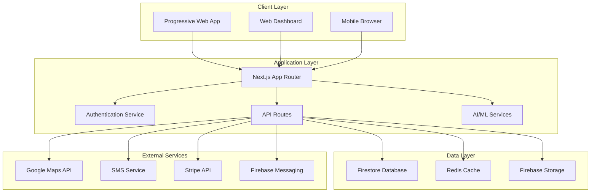

# TaxiNow/MyBase - Technical Design Document

## Overview

This document outlines the technical architecture and design decisions for the TaxiNow/MyBase platform, a multi-sided taxi booking marketplace that connects passengers, drivers, and operators through a commission-free model with AI-enhanced features.

## Architecture

### System Architecture Overview



### Technology Stack

#### Frontend
- **Framework:** Next.js 14+ with App Router
- **Language:** TypeScript for type safety
- **Styling:** Tailwind CSS + ShadCN UI components
- **State Management:** React Query (TanStack Query) + Context API
- **Real-time Updates:** Firebase SDK + WebSocket connections
- **Maps:** Google Maps JavaScript API + React integration
- **PWA:** Next-PWA for offline capabilities

#### Backend
- **Runtime:** Node.js with Next.js API routes
- **Database:** Firebase Firestore (NoSQL, real-time)
- **Authentication:** Firebase Authentication
- **File Storage:** Firebase Storage
- **Caching:** Redis for session and frequently accessed data
- **AI/ML:** Google Genkit for AI features

#### External Integrations
- **Maps & Navigation:** Google Maps Platform (Maps, Places, Directions APIs)
- **SMS Verification:** Twilio or Firebase Phone Auth
- **Payments:** Stripe for secure payment processing
- **Push Notifications:** Firebase Cloud Messaging
- **Email:** SendGrid or similar for transactional emails

## Components and Interfaces

### Core Components Architecture

#### 1. Authentication System
```typescript
interface AuthService {
  // User registration with role-based setup
  registerUser(userData: UserRegistrationData): Promise<AuthResult>
  
  // Multi-role login system
  loginUser(credentials: LoginCredentials): Promise<AuthResult>
  
  // Phone verification for security
  verifyPhone(phoneNumber: string, code: string): Promise<VerificationResult>
  
  // Role-based access control
  checkPermissions(userId: string, resource: string): Promise<boolean>
}

interface UserRegistrationData {
  name: string
  email: string
  password: string
  role: 'passenger' | 'driver' | 'operator' | 'admin'
  phoneNumber?: string
  vehicleCategory?: VehicleCategory
  operatorCode?: string
}
```

#### 2. Ride Management System
```typescript
interface RideService {
  // Create new ride request
  createRide(rideRequest: RideRequest): Promise<Ride>
  
  // Match drivers based on criteria
  matchDrivers(rideId: string, criteria: MatchingCriteria): Promise<Driver[]>
  
  // Real-time ride tracking
  trackRide(rideId: string): Observable<RideStatus>
  
  // Handle ride lifecycle
  updateRideStatus(rideId: string, status: RideStatus): Promise<void>
}

interface RideRequest {
  passengerId: string
  pickupLocation: GeoLocation
  destinationLocation: GeoLocation
  scheduledTime?: Date
  vehiclePreference?: VehicleCategory
  operatorPreference?: string
  specialRequirements?: string[]
}

interface Ride {
  id: string
  passengerId: string
  driverId?: string
  operatorId?: string
  status: RideStatus
  pickupLocation: GeoLocation
  destinationLocation: GeoLocation
  estimatedFare: number
  actualFare?: number
  createdAt: Date
  scheduledTime?: Date
  startTime?: Date
  endTime?: Date
}
```

#### 3. Real-time Location System
```typescript
interface LocationService {
  // Track driver locations
  updateDriverLocation(driverId: string, location: GeoLocation): Promise<void>
  
  // Get nearby drivers
  getNearbyDrivers(location: GeoLocation, radius: number): Promise<Driver[]>
  
  // Real-time location streaming
  subscribeToLocationUpdates(entityId: string): Observable<GeoLocation>
  
  // Geofencing for pickup/dropoff
  createGeofence(location: GeoLocation, radius: number): Promise<Geofence>
}

interface GeoLocation {
  latitude: number
  longitude: number
  accuracy?: number
  timestamp: Date
  heading?: number
  speed?: number
}
```

#### 4. AI Matching System
```typescript
interface AIService {
  // Intelligent driver-passenger matching
  optimizeMatching(rideRequest: RideRequest): Promise<MatchingResult>
  
  // Demand prediction
  predictDemand(location: GeoLocation, timeWindow: TimeWindow): Promise<DemandForecast>
  
  // Route optimization
  optimizeRoute(waypoints: GeoLocation[]): Promise<OptimizedRoute>
  
  // Pricing optimization
  calculateDynamicPricing(rideRequest: RideRequest): Promise<PricingResult>
}

interface MatchingResult {
  recommendedDrivers: Driver[]
  confidence: number
  reasoning: string
  estimatedPickupTime: number
  alternativeOptions: Driver[]
}
```

#### 5. Communication System
```typescript
interface CommunicationService {
  // In-app messaging
  sendMessage(fromUserId: string, toUserId: string, message: Message): Promise<void>
  
  // Push notifications
  sendNotification(userId: string, notification: Notification): Promise<void>
  
  // SMS notifications
  sendSMS(phoneNumber: string, message: string): Promise<void>
  
  // Real-time chat
  subscribeToChat(chatId: string): Observable<Message[]>
}

interface Message {
  id: string
  fromUserId: string
  toUserId: string
  content: string
  type: 'text' | 'location' | 'system'
  timestamp: Date
  read: boolean
}
```

## Data Models

### User Management Schema

```typescript
// Users Collection
interface User {
  uid: string
  name: string
  email: string
  role: UserRole
  phoneNumber?: string
  phoneVerified: boolean
  status: 'Active' | 'Pending Approval' | 'Suspended'
  createdAt: Timestamp
  lastLoginAt?: Timestamp
  customId?: string // Passenger ID or Driver ID
  operatorCode?: string
  vehicleCategory?: VehicleCategory
  profileImageUrl?: string
  preferences?: UserPreferences
}

// Drivers Collection (Extended user data)
interface Driver {
  uid: string
  name: string
  email: string
  operatorCode: string
  vehicleCategory: VehicleCategory
  licenseNumber: string
  vehicleRegistration: string
  status: 'Active' | 'Inactive' | 'Suspended'
  availability: 'online' | 'offline' | 'busy'
  location?: GeoLocation
  rating: number
  totalRides: number
  earnings: DriverEarnings
  documents: DriverDocuments
}

// Operators Collection
interface Operator {
  operatorCode: string
  name: string
  contactEmail: string
  contactPhone: string
  address: Address
  serviceArea: GeoArea[]
  status: 'Active' | 'Inactive' | 'Pending'
  settings: OperatorSettings
  subscription: SubscriptionDetails
  drivers: string[] // Driver UIDs
}
```

### Ride Management Schema

```typescript
// Rides Collection
interface Ride {
  id: string
  passengerId: string
  driverId?: string
  operatorId?: string
  status: RideStatus
  type: 'immediate' | 'scheduled'
  
  // Location data
  pickupLocation: GeoLocation
  destinationLocation: GeoLocation
  actualRoute?: GeoLocation[]
  
  // Timing
  requestedAt: Timestamp
  scheduledTime?: Timestamp
  acceptedAt?: Timestamp
  arrivedAt?: Timestamp
  startedAt?: Timestamp
  completedAt?: Timestamp
  
  // Financial
  estimatedFare: number
  actualFare?: number
  paymentMethod: PaymentMethod
  paymentStatus: PaymentStatus
  
  // Additional data
  vehiclePreference?: VehicleCategory
  specialRequirements?: string[]
  rating?: RideRating
  feedback?: string
}

type RideStatus = 
  | 'requested' 
  | 'matched' 
  | 'accepted' 
  | 'driver_en_route' 
  | 'arrived' 
  | 'in_progress' 
  | 'completed' 
  | 'cancelled'

// Real-time ride tracking
interface RideTracking {
  rideId: string
  driverLocation: GeoLocation
  estimatedArrival: Date
  route: GeoLocation[]
  traffic: TrafficCondition
  lastUpdated: Timestamp
}
```

### Financial Schema

```typescript
// Earnings Collection (for drivers)
interface Earnings {
  id: string
  driverId: string
  rideId: string
  date: string // YYYY-MM-DD format
  grossEarning: number
  netEarning: number // Same as gross (0% commission)
  tips?: number
  paymentMethod: PaymentMethod
  status: 'pending' | 'paid' | 'disputed'
}

// Credit Accounts (for operator account jobs)
interface CreditAccount {
  id: string
  driverId: string
  operatorId: string
  balance: number
  transactions: CreditTransaction[]
  lastUpdated: Timestamp
}

interface CreditTransaction {
  id: string
  type: 'credit' | 'debit'
  amount: number
  description: string
  rideId?: string
  timestamp: Timestamp
}
```

## Error Handling

### Error Classification System

```typescript
enum ErrorType {
  AUTHENTICATION = 'AUTHENTICATION',
  AUTHORIZATION = 'AUTHORIZATION',
  VALIDATION = 'VALIDATION',
  NETWORK = 'NETWORK',
  EXTERNAL_SERVICE = 'EXTERNAL_SERVICE',
  BUSINESS_LOGIC = 'BUSINESS_LOGIC',
  SYSTEM = 'SYSTEM'
}

interface AppError {
  type: ErrorType
  code: string
  message: string
  details?: any
  timestamp: Date
  userId?: string
  requestId?: string
}

// Error handling middleware
class ErrorHandler {
  static handle(error: AppError): ErrorResponse {
    // Log error for monitoring
    this.logError(error)
    
    // Return user-friendly response
    return {
      success: false,
      error: {
        code: error.code,
        message: this.getUserMessage(error),
        requestId: error.requestId
      }
    }
  }
  
  private static getUserMessage(error: AppError): string {
    switch (error.type) {
      case ErrorType.AUTHENTICATION:
        return "Please log in to continue"
      case ErrorType.NETWORK:
        return "Connection issue. Please try again"
      case ErrorType.EXTERNAL_SERVICE:
        return "Service temporarily unavailable"
      default:
        return "Something went wrong. Please try again"
    }
  }
}
```

### Retry and Resilience Patterns

```typescript
// Exponential backoff for external API calls
class RetryService {
  static async withRetry<T>(
    operation: () => Promise<T>,
    maxRetries: number = 3,
    baseDelay: number = 1000
  ): Promise<T> {
    for (let attempt = 1; attempt <= maxRetries; attempt++) {
      try {
        return await operation()
      } catch (error) {
        if (attempt === maxRetries) throw error
        
        const delay = baseDelay * Math.pow(2, attempt - 1)
        await this.sleep(delay)
      }
    }
    throw new Error('Max retries exceeded')
  }
  
  private static sleep(ms: number): Promise<void> {
    return new Promise(resolve => setTimeout(resolve, ms))
  }
}

// Circuit breaker for external services
class CircuitBreaker {
  private failures = 0
  private lastFailureTime?: Date
  private state: 'CLOSED' | 'OPEN' | 'HALF_OPEN' = 'CLOSED'
  
  constructor(
    private threshold: number = 5,
    private timeout: number = 60000
  ) {}
  
  async execute<T>(operation: () => Promise<T>): Promise<T> {
    if (this.state === 'OPEN') {
      if (Date.now() - this.lastFailureTime!.getTime() > this.timeout) {
        this.state = 'HALF_OPEN'
      } else {
        throw new Error('Circuit breaker is OPEN')
      }
    }
    
    try {
      const result = await operation()
      this.onSuccess()
      return result
    } catch (error) {
      this.onFailure()
      throw error
    }
  }
  
  private onSuccess(): void {
    this.failures = 0
    this.state = 'CLOSED'
  }
  
  private onFailure(): void {
    this.failures++
    this.lastFailureTime = new Date()
    
    if (this.failures >= this.threshold) {
      this.state = 'OPEN'
    }
  }
}
```

## Testing Strategy

### Testing Pyramid

#### Unit Tests (70%)
- Component logic testing
- Service function testing
- Utility function testing
- Data model validation

```typescript
// Example unit test
describe('RideService', () => {
  describe('calculateFare', () => {
    it('should calculate correct fare for standard ride', () => {
      const distance = 5.2 // km
      const duration = 15 // minutes
      const expected = 12.50 // £
      
      const result = RideService.calculateFare(distance, duration)
      
      expect(result).toBe(expected)
    })
    
    it('should apply surge pricing during peak hours', () => {
      const distance = 5.2
      const duration = 15
      const peakTime = new Date('2024-01-15T17:30:00') // Rush hour
      
      const result = RideService.calculateFare(distance, duration, peakTime)
      
      expect(result).toBeGreaterThan(12.50)
    })
  })
})
```

#### Integration Tests (20%)
- API endpoint testing
- Database integration testing
- External service integration testing

```typescript
// Example integration test
describe('Ride API', () => {
  it('should create ride and match driver', async () => {
    // Setup test data
    const passenger = await createTestUser('passenger')
    const driver = await createTestDriver()
    
    // Create ride request
    const rideRequest = {
      passengerId: passenger.uid,
      pickupLocation: { lat: 53.6450, lng: -1.7830 },
      destinationLocation: { lat: 53.6500, lng: -1.7800 }
    }
    
    // Test ride creation
    const response = await request(app)
      .post('/api/rides')
      .send(rideRequest)
      .expect(201)
    
    expect(response.body.ride.id).toBeDefined()
    expect(response.body.ride.status).toBe('requested')
    
    // Verify driver matching
    const matchedRide = await getRide(response.body.ride.id)
    expect(matchedRide.driverId).toBe(driver.uid)
  })
})
```

#### End-to-End Tests (10%)
- Complete user journey testing
- Cross-browser compatibility
- Mobile responsiveness testing

```typescript
// Example E2E test with Playwright
test('passenger can book and complete ride', async ({ page }) => {
  // Login as passenger
  await page.goto('/login')
  await page.fill('[data-testid=email]', 'passenger@test.com')
  await page.fill('[data-testid=password]', 'password123')
  await page.click('[data-testid=login-button]')
  
  // Navigate to booking
  await page.click('[data-testid=book-ride-button]')
  
  // Set pickup and destination
  await page.fill('[data-testid=pickup-input]', 'Huddersfield Train Station')
  await page.fill('[data-testid=destination-input]', 'University of Huddersfield')
  
  // Confirm booking
  await page.click('[data-testid=confirm-booking]')
  
  // Verify ride creation
  await expect(page.locator('[data-testid=ride-status]')).toContainText('Finding driver')
  
  // Simulate driver acceptance (in real test, would use separate driver session)
  await simulateDriverAcceptance()
  
  // Verify ride tracking
  await expect(page.locator('[data-testid=ride-status]')).toContainText('Driver en route')
  await expect(page.locator('[data-testid=driver-map]')).toBeVisible()
})
```

### Performance Testing

```typescript
// Load testing configuration
const loadTestConfig = {
  scenarios: {
    // Normal load
    normal_load: {
      executor: 'constant-vus',
      vus: 100,
      duration: '10m'
    },
    
    // Peak load (rush hour simulation)
    peak_load: {
      executor: 'ramping-vus',
      startVUs: 0,
      stages: [
        { duration: '2m', target: 500 },
        { duration: '5m', target: 500 },
        { duration: '2m', target: 0 }
      ]
    },
    
    // Stress test
    stress_test: {
      executor: 'ramping-vus',
      startVUs: 0,
      stages: [
        { duration: '5m', target: 1000 },
        { duration: '10m', target: 1000 },
        { duration: '5m', target: 0 }
      ]
    }
  },
  
  thresholds: {
    http_req_duration: ['p(95)<500'], // 95% of requests under 500ms
    http_req_failed: ['rate<0.01'],   // Error rate under 1%
    checks: ['rate>0.99']             // 99% of checks pass
  }
}
```

## Security Considerations

### Authentication & Authorization

```typescript
// JWT token structure
interface JWTPayload {
  uid: string
  email: string
  role: UserRole
  operatorCode?: string
  permissions: Permission[]
  iat: number
  exp: number
}

// Role-based access control
const PERMISSIONS = {
  PASSENGER: ['book_ride', 'view_own_rides', 'rate_driver'],
  DRIVER: ['accept_rides', 'update_location', 'view_earnings'],
  OPERATOR: ['manage_drivers', 'view_fleet', 'assign_rides'],
  ADMIN: ['manage_users', 'view_analytics', 'system_config']
} as const

// Middleware for route protection
function requirePermission(permission: Permission) {
  return (req: AuthenticatedRequest, res: Response, next: NextFunction) => {
    if (!req.user.permissions.includes(permission)) {
      return res.status(403).json({ error: 'Insufficient permissions' })
    }
    next()
  }
}
```

### Data Protection

```typescript
// Data encryption for sensitive information
class EncryptionService {
  private static readonly algorithm = 'aes-256-gcm'
  private static readonly keyLength = 32
  
  static encrypt(text: string, key: Buffer): EncryptedData {
    const iv = crypto.randomBytes(16)
    const cipher = crypto.createCipher(this.algorithm, key)
    cipher.setAAD(Buffer.from('additional-data'))
    
    let encrypted = cipher.update(text, 'utf8', 'hex')
    encrypted += cipher.final('hex')
    
    const authTag = cipher.getAuthTag()
    
    return {
      encrypted,
      iv: iv.toString('hex'),
      authTag: authTag.toString('hex')
    }
  }
  
  static decrypt(encryptedData: EncryptedData, key: Buffer): string {
    const decipher = crypto.createDecipher(this.algorithm, key)
    decipher.setAAD(Buffer.from('additional-data'))
    decipher.setAuthTag(Buffer.from(encryptedData.authTag, 'hex'))
    
    let decrypted = decipher.update(encryptedData.encrypted, 'hex', 'utf8')
    decrypted += decipher.final('utf8')
    
    return decrypted
  }
}

// PII data handling
interface PIIData {
  phoneNumber?: string
  address?: string
  paymentInfo?: string
}

class PIIHandler {
  static sanitize(data: any): any {
    const sanitized = { ...data }
    
    // Remove or mask sensitive fields
    if (sanitized.phoneNumber) {
      sanitized.phoneNumber = this.maskPhoneNumber(sanitized.phoneNumber)
    }
    
    if (sanitized.paymentInfo) {
      delete sanitized.paymentInfo
    }
    
    return sanitized
  }
  
  private static maskPhoneNumber(phone: string): string {
    return phone.replace(/(\d{3})\d{4}(\d{3})/, '$1****$2')
  }
}
```

### API Security

```typescript
// Rate limiting configuration
const rateLimitConfig = {
  windowMs: 15 * 60 * 1000, // 15 minutes
  max: 100, // Limit each IP to 100 requests per windowMs
  message: 'Too many requests from this IP',
  standardHeaders: true,
  legacyHeaders: false,
  
  // Different limits for different endpoints
  keyGenerator: (req: Request) => {
    return req.ip + ':' + req.path
  },
  
  // Custom limits for authenticated users
  skip: (req: Request) => {
    if (req.user?.role === 'admin') return true
    return false
  }
}

// Input validation and sanitization
const rideRequestSchema = z.object({
  pickupLocation: z.object({
    latitude: z.number().min(-90).max(90),
    longitude: z.number().min(-180).max(180)
  }),
  destinationLocation: z.object({
    latitude: z.number().min(-90).max(90),
    longitude: z.number().min(-180).max(180)
  }),
  scheduledTime: z.date().optional(),
  vehiclePreference: z.enum(['car', 'estate', 'minibus_6', 'minibus_8']).optional(),
  specialRequirements: z.array(z.string().max(100)).max(5).optional()
})

// CORS configuration
const corsOptions = {
  origin: process.env.NODE_ENV === 'production' 
    ? ['https://mybase.app', 'https://www.mybase.app']
    : ['http://localhost:3000'],
  credentials: true,
  optionsSuccessStatus: 200
}
```

This technical design document provides a comprehensive foundation for implementing the TaxiNow/MyBase platform, covering architecture, data models, error handling, testing strategies, and security considerations. The modular design ensures scalability, maintainability, and robust performance across all user types and use cases.